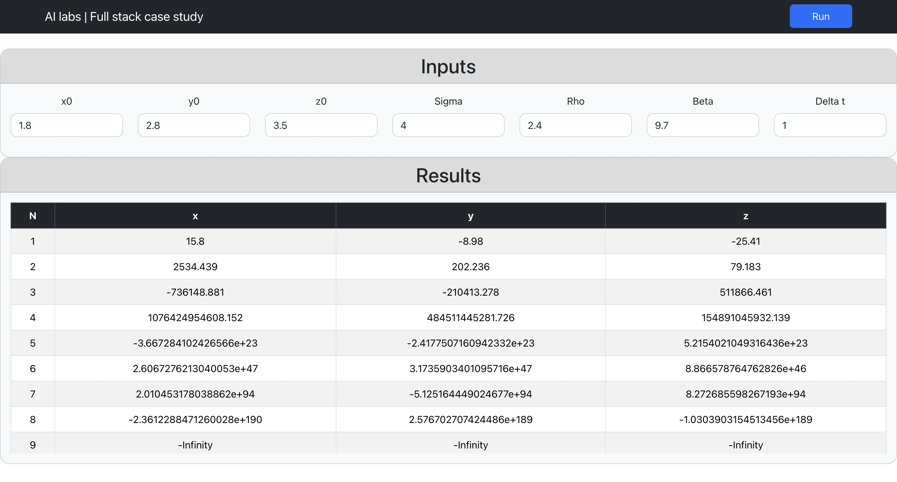
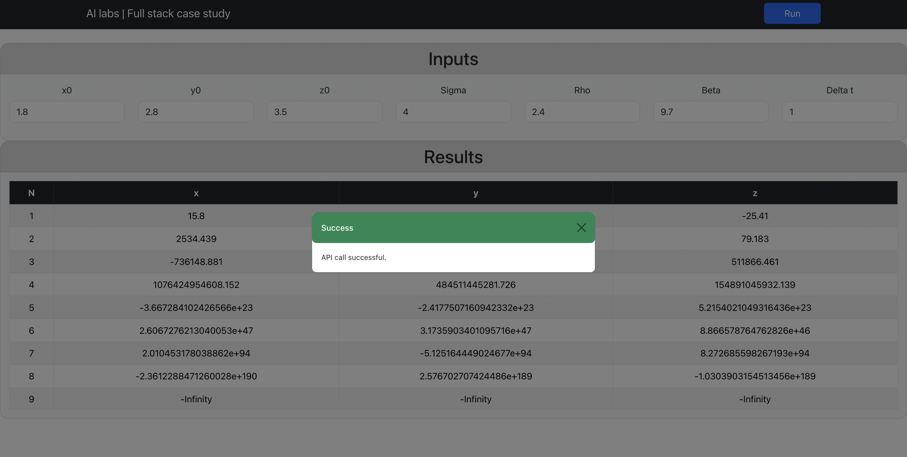
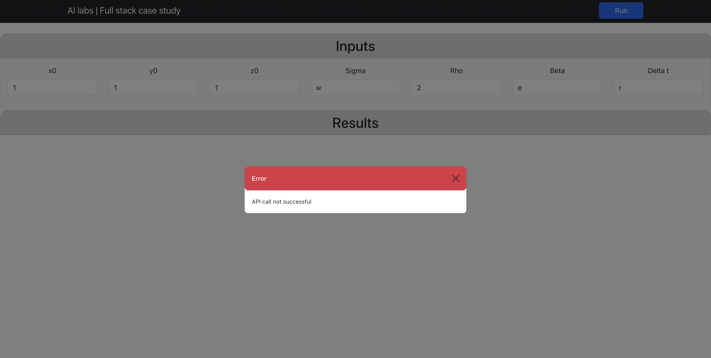
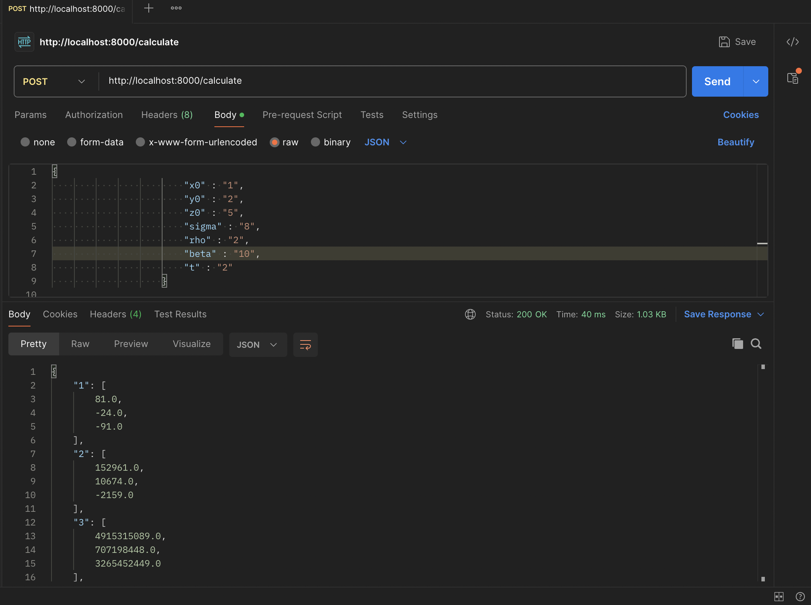
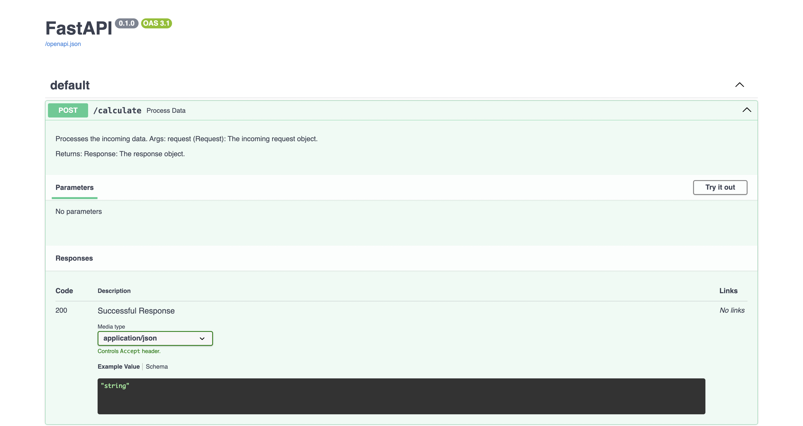

# UI AND API README

# UI output



# UI Success alert output



# UI Failure alert output



# Postman output



# Swagger Output




# UI README

## Overview

The app consists of a simple frontend and corresponding backend that simulates the system for 20 time steps. The UI is fully responsive and developed with React JS and React-Bootstrap for styling. The table is scrollable and has a sticky header.

## Instructions

1) Run the following commands to initialize react project

```bash
npx create-react-app my-app
cd my-app
npm install
```
Make sure you have node installed.

2) To install React- Bootstrap run:
   ```bash
   npm install react-bootstrap bootstrap
   ```
3) To run the project

```bash

  npm start
  ```
4) To run tests:
```bash
 npm test
```


# API README

## Overview
This API serves a specific purpose, providing functionalities to perform calculations based on input parameters. It offers endpoints for different operations and includes an automatically generated API documentation adhering to the OpenAPI schema. I have also created a Swagger link to test the API easily


## Usage

### Endpoints
The following endpoints are exposed by the API:

- `/calculate`:
  - **Type of Request**: POST
  - **Request Body**: JSON containing numeric parameters:
    ```json
    {
        "x0": "101",
        "y0": "20",
        "z0": "30.45353",
        "sigma": "0.1234434443847847",
        "rho": "0.25",
        "beta": "0.456",
        "t": "0.23"
    }
    ```

- `/docs`: 
  - Auto-generated API documentation conforming to the OpenAPI schema.

### Swagger Link for API testing
http://localhost:8000/docs#/default/process_data_calculate_post

### Requirements
- Python version 3 or higher should be installed.

### Usage

#### Unit Tests
Unit test cases are available under `app/tests/`. To run them, execute the following command:
```bash
pytest app/tests 
```

### Setting Up and Running the Server

To start the server, follow these steps:

1. **Start the Python virtual environment:**
```bash
cd backend
python -m venv .venv
source ./.venv/bin/activate 
```

2. Install the required libraries:
 ```bash
   pip3/pip install -r requirements.txt 
```
4. Start the backend server:
```bash
   uvicorn app.main:app --reload [--port <port>] 
```
6. The default port is 8000.
7. Logs generated by the application are stored at app/utils/logs/logs.log. These logs capture important information about the API's activities and can be useful for troubleshooting and monitoring purposes.

